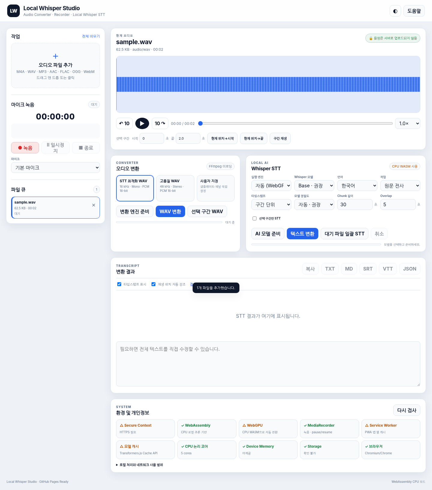

# Local Whisper Studio



GitHub Pages에서 동작하는 **완전 정적(static) 로컬 오디오 변환·녹음·Whisper STT 웹앱**입니다.

> 음성 파일과 전사 결과를 서버로 업로드하지 않습니다. 오디오 처리와 STT 추론은 사용자 브라우저 안에서 수행됩니다. 최초 실행 시 FFmpeg WebAssembly core와 선택한 Whisper ONNX 모델을 외부 CDN/Hugging Face에서 내려받습니다.

## 주요 기능

- M4A / AAC / MP3 / WAV / FLAC / OGG / WebM 등 파일 추가 및 드래그앤드롭
- 다중 파일 큐, 파일별 STT 상태 관리
- 내장 영어 예제 음성으로 설치 직후 STT 시험
- 마이크 녹음 / 일시정지 / 재개 / 종료
- 마이크 장치 선택 및 실시간 레벨 미터
- 파형 표시, 클릭 탐색, ±10초 이동, 0.5–2.0× 재생 속도
- 구간 시작/끝 지정 및 선택 구간 재생
- FFmpeg.wasm 기반 WAV 변환
  - STT 최적화: 16 kHz / Mono / PCM16
  - 고품질: 48 kHz / Stereo / PCM16
  - 사용자 지정 sample rate / channel
  - 선택 구간만 WAV 저장
- Whisper STT (Transformers.js)
  - WebGPU GPU 우선 / WASM CPU fallback
  - Tiny / Base / Small / Large-v3-Turbo 선택
  - 한국어/영어/일본어/중국어/독일어/프랑스어/스페인어 및 자동 감지
  - transcribe / translate
  - segment / word timestamp
  - chunk length / overlap 조절
  - 선택 구간만 STT
  - 대기 파일 일괄 STT
- 결과 편집 및 재생 위치에 따른 transcript 강조
- TXT / Markdown / JSON / SRT / VTT 내보내기
- 설정 localStorage 저장
- Transformers.js 모델 Browser Cache 활용
- PWA 설치 및 앱 셸 오프라인 캐시
- 브라우저 시스템 진단(WebGPU, WASM, MediaRecorder, Storage 등)
- 반응형 UI / 다크 모드 / 키보드 단축키

## 권장 브라우저

- Windows: 최신 **Chrome 또는 Edge** 권장
- WebGPU가 사용 가능하면 GPU 추론을 사용하고, 불가능하면 WASM CPU 모드로 자동 전환합니다.
- 큰 모델은 브라우저 메모리를 많이 사용합니다. 먼저 `Whisper Base`로 확인한 뒤 `Small`을 권장합니다.

## GitHub Pages 배포

1. 이 폴더의 모든 파일을 GitHub repository root에 업로드합니다.
2. GitHub repository → **Settings → Pages**로 이동합니다.
3. `Deploy from a branch`를 선택합니다.
4. Branch: `main`, Folder: `/(root)`를 선택하고 저장합니다.
5. 생성된 `https://<username>.github.io/<repository>/` 주소로 접속합니다.

별도의 Node.js, Python, `uv`, 서버, API key가 필요하지 않습니다.

## 로컬 테스트

마이크와 Service Worker 때문에 `file://`로 직접 열기보다 로컬 HTTP 서버에서 실행하십시오.

```bash
python -m http.server 8080
```

또는

```bash
npx serve .
```

그 후 `http://localhost:8080`으로 접속합니다.

## 네트워크 동작

최초 사용 시 다음 리소스를 다운로드할 수 있습니다.

- `@ffmpeg/core` WebAssembly core: jsDelivr
- `@huggingface/transformers`: jsDelivr
- Whisper ONNX model: Hugging Face Hub

오디오 파일을 외부 서비스로 `fetch`, `POST`, `upload`하는 코드는 없습니다.

## 기술 구조

```text
Audio file / Microphone
        │
        ├── MediaRecorder
        │
        ├── AudioContext / OfflineAudioContext
        │        └── 16 kHz mono Float32 PCM
        │
        ├── FFmpeg.wasm Worker
        │        └── M4A/MP3/... → WAV
        │
        └── STT Worker
                 └── Transformers.js + Whisper ONNX
                         ├── WebGPU
                         └── WASM CPU fallback
```

## 제한 사항

- GitHub Pages에서는 CUDA, `faster-whisper`, Python `uv` 환경을 직접 실행할 수 없습니다.
- 브라우저 WebGPU는 CUDA가 아니라 브라우저 GPU API입니다.
- 매우 큰 오디오 파일이나 Large 모델은 브라우저 메모리 한계에 영향을 받을 수 있습니다.
- 브라우저가 원본 M4A를 AudioContext로 해석하지 못하면 FFmpeg.wasm을 통해 WAV로 변환한 뒤 STT합니다.
- PWA 앱 셸은 오프라인 캐시되지만, 외부 라이브러리와 모델은 최초 다운로드가 필요합니다. Transformers.js는 Browser Cache를 사용합니다.

## 라이선스 참고

이 프로젝트 자체 샘플 코드는 자유롭게 수정하여 사용할 수 있도록 작성되었습니다. 배포 시 사용하는 외부 구성요소의 라이선스를 별도로 확인하십시오.

- Transformers.js: Apache-2.0
- @ffmpeg/ffmpeg wrapper: MIT (본 프로젝트는 자체 최소 Worker client를 사용)
- @ffmpeg/core / FFmpeg WebAssembly core: upstream 라이선스 조건 확인 필요


See [`THIRD_PARTY_NOTICES.md`](./THIRD_PARTY_NOTICES.md) for runtime dependency notices.
